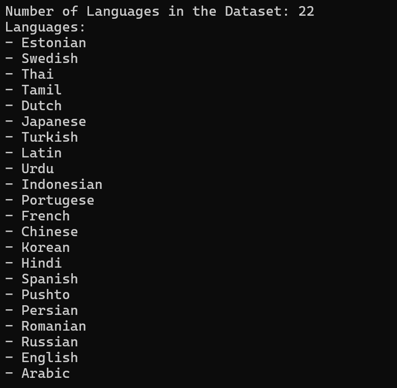
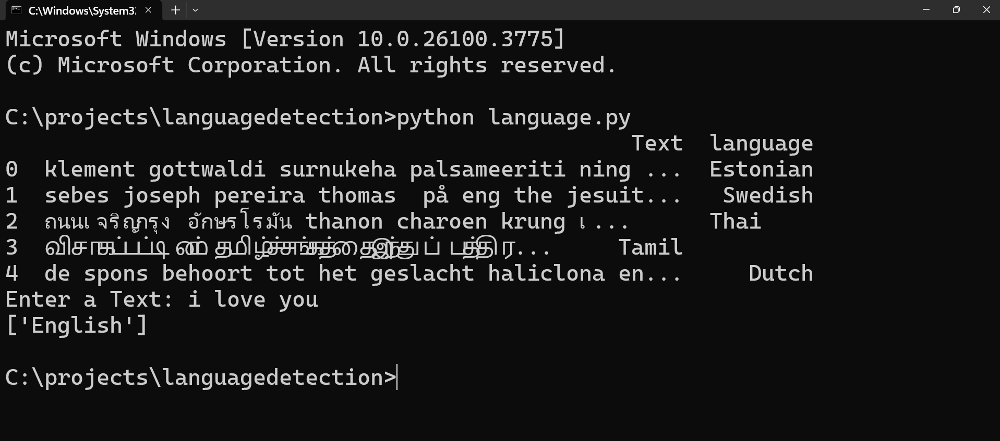
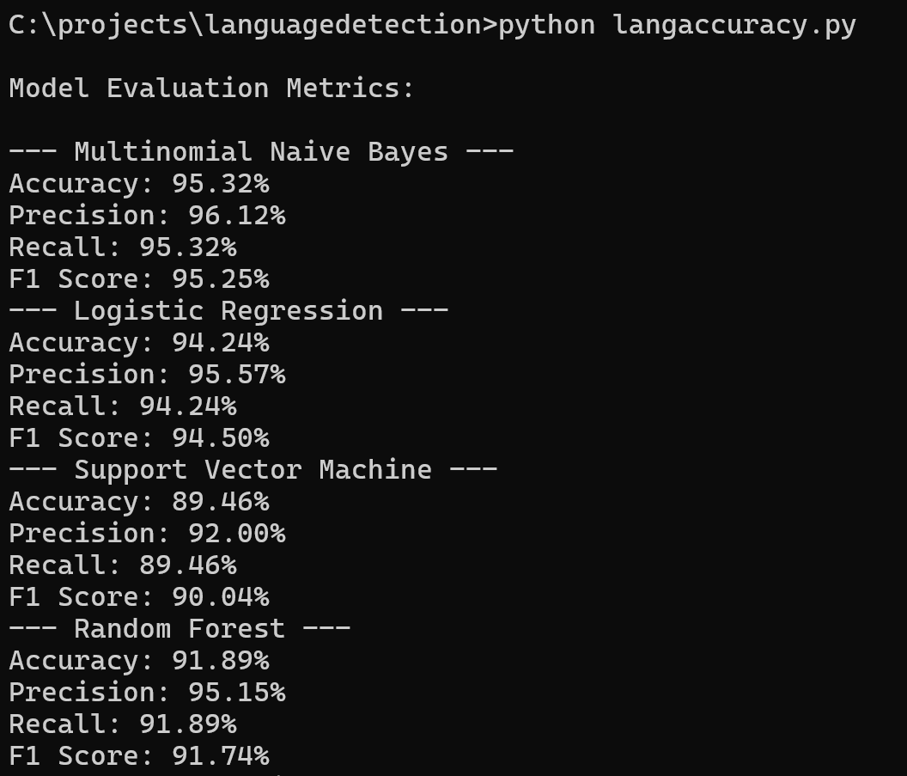
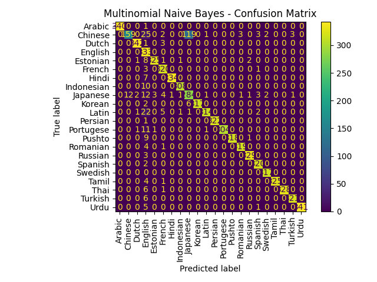

# LanguageDetectionUsingMLAlgorithms
# 🌐 Language Detection Using Machine Learning Algorithms

A Machine Learning-based system to automatically detect the language of a given text using the **Multinomial Naive Bayes** classifier. This project demonstrates **Natural Language Processing (NLP)** techniques applied to language classification.

---

## 📄 Table of Contents
- [📖 About](#about)
- [✨ Features](#features)
- [🧰 Tech Stack](#tech-stack)
- [📊 Dataset](#dataset)
- [🧠 Algorithm Used](#algorithm-used)
- [⚙️ Installation](#installation)
- [🚀 Usage](#usage)
- [🖼️ Sample Output](#sample-output)
- [🧾 Requirements](#requirements)


---

## 📖 About

Language detection plays a vital role in various multilingual applications such as translation systems, chatbots, content filtering, and social media analytics.

This project uses **Natural Language Processing (NLP)** techniques along with **Machine Learning** to classify the input text into one of the many supported languages. The model is simple, lightweight, and suitable for real-time predictions.

---

## ✨ Features

- Detects multiple languages automatically.
- Implements the **Multinomial Naive Bayes** algorithm.
- Fast and accurate predictions on short texts.
- Easy to understand and extend.
- Clean Python code with proper comments.
- Works as a standalone script or in Jupyter Notebooks.

---

## 🧰 Tech Stack

**Programming Language**:  
- Python

**Libraries and Tools**:
- `pandas`
- `numpy`
- `scikit-learn`
- `nltk`
- `matplotlib`, `seaborn` (for performance visualization)
- Jupyter Notebook / Python script

---

## 📊 Dataset

**Source**: GitHub - Language Dataset  
**Description**: The dataset contains labeled text samples across multiple languages. Each record has:
- `Text`: A sentence in a specific language.
- `Language`: The corresponding language label.

The dataset supports detection of **22 languages**.
 
 

---

## 🧠 Algorithm Used

**Multinomial Naive Bayes (MNB)**:  
A probabilistic classifier based on **Bayes’ Theorem**, particularly effective for features that represent frequencies or counts (like word frequencies in text).

Steps:
1. Text preprocessing using NLTK (tokenization, stopword removal).
2. Feature extraction using **CountVectorizer** or **TF-IDF**.
3. Training the classifier using scikit-learn’s `MultinomialNB`.

---

## 🤖 sample-output



## PERFORMANCE METRICS



## CONFUSION MATRIX



----

## ⚙️ Installation

Make sure you have Python and pip installed.

```bash
# Clone the repository
git clone https://github.com/Rajkumarpatel445/LanguageDetectionUsingMLAlgorithms.git
cd LanguageDetectionUsingMLAlgorithms

# Install required libraries
pip install -r requirements.txt

